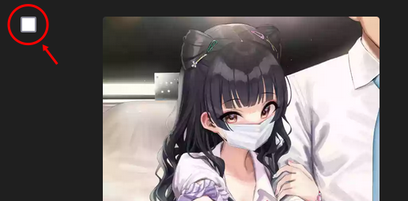
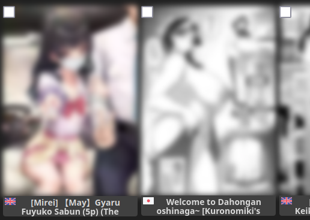
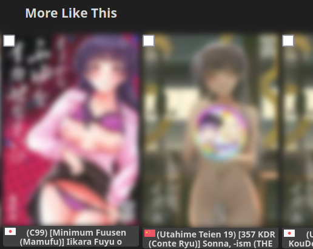
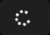
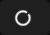
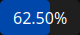
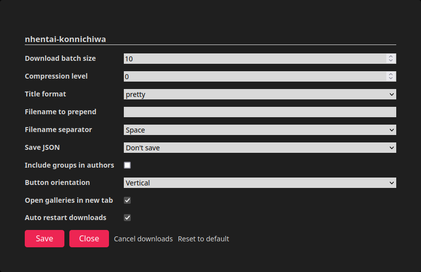

<p align="center">
  
  <br>
  <a href="https://www.codefactor.io/repository/github/naiymu/nhentai-konnichiwa/overview/main"></a>
</p>
<h1 align="center">NHentai Konnichiwa</h1>
<p align="center">
  A simple usercript for downloading galleries from NHentai and mirrors
</p>

## Description
Userscript to download galleries from NHentai. It has features to be used with
[konnichiwa](https://github.com/naiymu/konnichiwa). NHentai started using
Cloudflare protection and now you can't reliably download hentai with the
download tab in konnichiwa. To make things easier for yourself if you use
konnichiwa, you could use this userscript.

If you don't use konnichiwa, you can still use this without losing any
functionality.

This script downloads a single zip file with separate directories for all
selected galleries inside it. The name of the zip file is the number of
milliseconds since January 1, 1970.

Supports only
[Tampermonkey](https://www.tampermonkey.net/)
and
[Violentmonkey](https://violentmonkey.github.io/).

## Install
- [Install](https://raw.githubusercontent.com/naiymu/nhentai-konnichiwa/master/nhentai-konnichiwa.user.js) from *github.com*
- [Install](https://greasyfork.org/scripts/446488-nhentai-konnichiwa/code/NHentai%20Konnichiwa.user.js) from *greasyfork.org*
- [Install](https://sleazyfork.org/scripts/446488-nhentai-konnichiwa/code/NHentai%20Konnichiwa.user.js) from *sleazyfork.org*

## Using with konnichiwa

For using with konnichiwa, extract the zip file, move the json file to the
`scripts/modification` directory and run the command:
```
php refresh_db.php [JSON-FILE-NAME]
```
This adds all the data to the database. Now move the downloaded directories
to your holy directory.

## Features
### Checkboxes at the top left corner of every gallery on any page

On the individual gallery page.

<p align="center">
  
</p>

On the homepage, search and similar pages.

<p align="center">
  
</p>

On the recommendations section.

<p align="center">
  
</p>

### Buttons at the bottom-left corner of the page
<p align="center">
  
</p>

- **Download button**: Download all selected galleries. The Download button changes state depending on the stage of download.
    If the data is being `fetched`, it looks like this:
    <p align="center">
      
    </p>
    If the data is being `downloaded`, it looks like this:
    <p align="center">
      
    </p>
    If the data is being `compressed`, it looks like this:
    <p align="center">
      
    </p>

- **Config button**: Change configuration options.

- **Check-all checkbox**: Select all galleries on the page. Note: Since there
are checkboxes on the recommendation ("More like this") section, if you check
this on a gallery page, it's recommendations will get selected as well.

### Configuration options

<p align="center">
  
</p>

- **Download batch size**: Number of downloads to run simultaneously.

    - *Minimum*: 1
    - *Maximum*: 50

    Default is 10. If you make it too high, a lot of downloads will fail.

- **Compression Level**: The level of compression for the final zip.
    - *Minumum*: 0 (No compression. Fastest.)
    - *Maximum*: 9 (Maximum compression. Slowest.)

- **Title format**: The galleries are downloaded in their own separate
directories. This option is for specifying the name of those directories.
There are four available options:

    - *pretty* `default`
    - *english*
    - *japanese*
    - *id*

- **Filename to prepend**: The text that gets added before every filename. If no
value is specified, The default filename is `{page}.{ext}`.

- **Filename separator**: The character to put between given *filename* (if any)
and `{page}`. So, if this value is set to `Underscore` and the filename is
set to `myFileName`, the files will be saved as `myFileName_{page}.{ext}`. The
symbols `/`, `\`, `|`, `:` and `;` will also be replaced by this separator,
both in the title and the `Filename to prepend` text provided.
There are three available options:

    - *Space* `default`
    - *Hyphen*
    - *Underscore*

- **Save JSON**: This is mainly for use with konnichiwa. This outputs a file in
the format specified
[here](https://github.com/naiymu/konnichiwa#with-the-refresh_db-script). There
are three available options:

    - *Don't save* `default`
    - *Save as JSON file*
    - *Copy to clipboard*

    *Save as JSON file* will save the content to a file with the same name as
    the zip file. You can then run `refresh_db.php` script from konnichiwa on
    this file to add all the downloaded galleries to your database.

- **Include groups in authors**: If the *Save JSON* option is set, the output
has a key `authors`. This decides if the 'Groups' in NHentai metadata will be
added to its value.

- **Button orientation**: The three buttons (download, config and check-all) are
by default aligned vertically. But if you want you can change this. There are
two available options:

    - Vertical `default`
    - Horizontal

- **Open galleries in new tab**: Galleries are opened in new tab by default.
You can turn this off if you want. But as a result, you will be prompted for
confirmation if you click on a gallery link.

- **Auto restart downloads**: Downlads are automatically restarted on page
change by default. You can turn this off if you want.

- **Cancel downloads**: You can choose to cancel ongoing downloads by clicking
this.

## Suggestions
Ongoing downloads will restart if you change the page. You can, of course, turn
this off. It's still recommended to stay on the page while a download is
ongoing.

## Supported sites
- nhentai.net
- nhentai.xxx
- nyahentai.red
- nhentai.to
- nhentai.website
